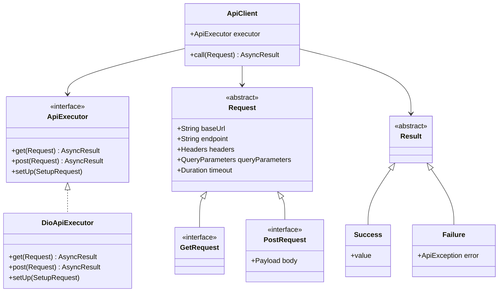

# network_y 🌐

## Description

`network_y` is a simple, flexible abstraction layer for handling network-related operations in Dart and Flutter applications. It provides a clean interface for making HTTP requests, managing responses, and handling errors, allowing easy integration and switching between different HTTP clients. 🚀

## Quick Start

Here's a minimal example to get you started with `network_y`:

```dart
// Define your request
class GetUserRequest extends GetRequest {
  GetUserRequest(int userId) : super(
    baseUrl: 'https://api.example.com',
    endpoint: '/users/$userId',
  );
}

// Set up the client
final apiClient = ApiClient(apiExecutor: DioApiExecutor());

// Make a request
final result = await apiClient<Map<String, Object?>>(GetUserRequest(1));

// Handle the result
result.fold(
  onSuccess: (data) => print('User data: $data'),
  onFailure: (error) => print('Error: ${error.userFriendlyMessage}'),
);
```

This simple example demonstrates how to define a request, set up the client, make a call, and handle the result.

## Key Components



### ApiExecutor 🔧

`ApiExecutor` is responsible for making the actual network requests. Internally, it can use various HTTP client packages like `dio`, `http`, etc. The beauty of this design is that you can easily switch between different executors without changing your application code.

### ApiClient 🖥️

`ApiClient` is the main class you'll interact with to make network requests. It takes an `ApiExecutor` as an argument, allowing you to easily switch between different network implementations.

```dart
final apiClient = ApiClient(apiExecutor: DioApiExecutor());
```

This design makes it simple to change your underlying HTTP client or mock network requests for testing.

## How to Use

### Request Types

- `GetRequest`: For GET requests 📥
- `PostRequest`: For POST requests with a body 📤

### ApiException

A comprehensive exception class that provides detailed information about network errors. 🚨

## Examples

### Making a GET Request

```dart
class UserGetRequest extends GetRequest {
  UserGetRequest({required int userId})
      : super(
          baseUrl: 'https://api.example.com',
          endpoint: '/users/$userId',
        );
}

final request = UserGetRequest(userId: 1);
final result = await apiClient.call<Map<String, Object?>>(request);

result.fold(
  onSuccess: (data) => print('User data: $data'),
  onFailure: (error) => print('Error: ${error.userFriendlyMessage}'),
);
```

### Making a POST Request

```dart
class CreateUserRequest extends PostRequest {
  CreateUserRequest({required String name, required String email})
      : super(
          baseUrl: 'https://api.example.com',
          endpoint: '/users',
          body: {'name': name, 'email': email},
        );
}

final request = CreateUserRequest(name: 'John Doe', email: 'john@example.com');
final result = await apiClient.call<Map<String, Object?>>(request);

result.fold(
  onSuccess: (data) => print('User created: $data'),
  onFailure: (error) => print('Error: ${error.userFriendlyMessage}'),
);
```

### Using a Base Request

In many applications, you'll have common parameters (like base URL, headers, or other values) that are shared across multiple requests. Instead of passing these to every request, you can create a base request and extend all other requests from it. Here's an example:

```dart
class BaseApiRequest extends Request {
  BaseApiRequest({
    required super.endpoint,
    super.baseUrl = 'https://api.example.com/',
    super.headers = const {
      'Content-Type': 'application/json',
      'Api-Version': 'v1',
    },
  });
}

class GetUserRequest extends BaseApiRequest implements GetRequest {
  GetUserRequest({
    required this.userId,
  }) : super(
          endpoint: 'users/$userId',
        );

  final String userId;
}

class CreatePostRequest extends BaseApiRequest implements PostRequest {
  CreatePostRequest({
    required this.title,
    required this.content,
    required this.authorId,
  }) : super(
          endpoint: 'posts',
        );

  final String title;
  final String content;
  final String authorId;

  @override
  Payload get body => {
        'title': title,
        'content': content,
        'author_id': authorId,
      };
}
```

This approach allows you to centralize common configurations and easily create specific requests for different endpoints. The `BaseApiRequest` sets up common parameters like the base URL and default headers, while specific request classes (`GetUserRequest`, `CreatePostRequest`) extend this base class and add their own unique properties and behaviors.

### Dynamic Headers

In some cases, you might not have access to certain header values (like authentication tokens) when defining your base request. The `network_y` package allows you to add these headers dynamically through the `setUp` method of the `ApiExecutor`. Here's how you can do it:

```dart
final apiExecutor = DioApiExecutor();

// Add dynamic headers during setup
apiExecutor.setUp(
  request: (
    headers: {
      'Authorization': 'Bearer ${getAuthToken()}',
      'Custom-Header': 'Some-Value',
    },
  ),
);

final apiClient = ApiClient(apiExecutor: apiExecutor);
```

This approach allows you to add or update headers that may not be available or may change frequently, such as authentication tokens or session-specific information. These headers will be applied to all requests made through the `apiClient`, in addition to any headers defined in your base or specific request classes.

## Getting Started 🏁

1. Add the package to your `pubspec.yaml`:

   ```yaml
   dependencies:
     network_y: ^0.0.4+3
   ```

2. Import the package in your Dart code:

   ```dart
   import 'package:network_y/network_y.dart';
   ```

3. Create an instance of `ApiClient` and start making requests!

---

Happy coding! 💻✨
