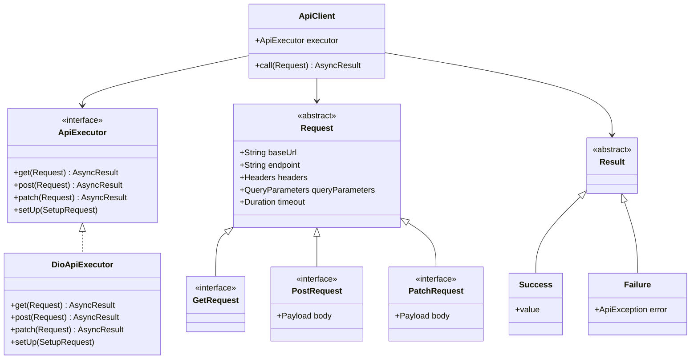

# network_y 🌐

## Description

`network_y` is a simple, flexible abstraction layer for handling network-related operations in Dart and Flutter applications. It provides a clean interface for making HTTP requests, managing responses, and handling errors, allowing easy integration and switching between different HTTP clients. 🚀

## Quick Start

Here's a minimal example to get you started with `network_y`:

```dart
// Define your request
class GetUserRequest extends GetRequest {
  GetUserRequest(int userId) : super(
    baseUrl: 'https://api.example.com',
    endpoint: '/users/$userId',
  );
}

// Set up the client
final apiClient = ApiClient(apiExecutor: DioApiExecutor());

// Make a request
final result = await apiClient<Map<String, Object?>>(GetUserRequest(1));

// Handle the result
result.fold(
  onSuccess: (data) => print('User data: $data'),
  onFailure: (error) => print('Error: ${error.userFriendlyMessage}'),
);
```

This simple example demonstrates how to define a request, set up the client, make a call, and handle the result.

## Key Components



### ApiExecutor 🔧

`ApiExecutor` is responsible for making the actual network requests. Internally, it can use various HTTP client packages like `dio`, `http`, etc. The beauty of this design is that you can easily switch between different executors without changing your application code.

### ApiClient 🖥️

`ApiClient` is the main class you'll interact with to make network requests. It takes an `ApiExecutor` as an argument, allowing you to easily switch between different network implementations.

```dart
final apiClient = ApiClient(apiExecutor: DioApiExecutor());
```

This design makes it simple to change your underlying HTTP client or mock network requests for testing.

## How to Use

### Request Types

- `GetRequest`: For GET requests 📥
- `PostRequest`: For POST requests with a body 📤
- `PatchRequest`: For PATCH requests with a body 🔄

### ApiException

A comprehensive exception class that provides detailed information about network errors. 🚨

## Examples

### Making a GET Request

```dart
class UserGetRequest extends GetRequest {
  UserGetRequest({required int userId})
      : super(
          baseUrl: 'https://api.example.com',
          endpoint: '/users/$userId',
        );
}

final request = UserGetRequest(userId: 1);
final result = await apiClient
